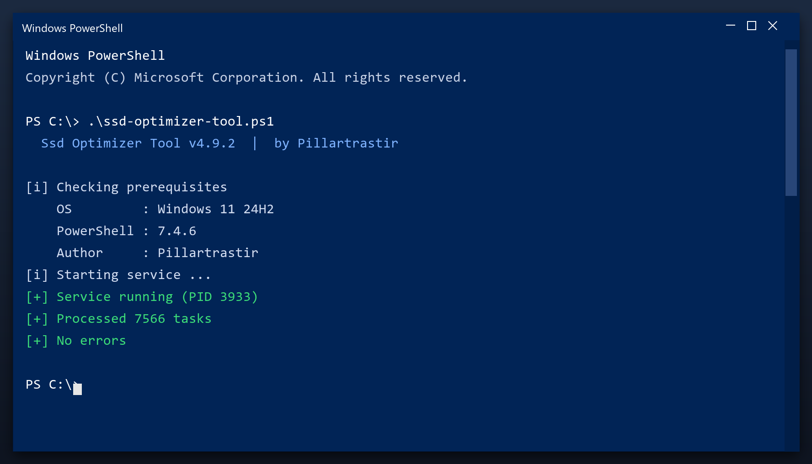

# Download Ssd Optimizer Tool for Free — Latest 2026 Version

  

**Ssd optimizer tool** is a Windows utility that keeps your PC clean and running fast. It is the current 2026 build, tested on Windows 10 and 11. **Free. No registration. No bundled adware.**

  

  

## What It Does

Ssd optimizer tool is what is often called a PC cleaner. It looks through the places Windows and your programs leave data behind - temp folders, logs, caches - and lets you remove it safely. A backup is made first, so nothing is lost by accident.

| **Term** | **Meaning** |
| --- | --- |
| **Temp folder** | Where programs dump scratch files |
| **Log** | A record file programs write |
| **Backup** | A copy you can restore |
| **Safe to delete** | Not needed by any program |

## Requirements

| **Component** | **Minimum** | **Notes** |
| --- | --- | --- |
| **Windows** | 10 (64-bit) | 11 fully supported |
| **RAM** | 2 GB | 4 GB for large scans |
| **Disk** | 100 MB | Plus space to clean |
| **Account** | Standard | Admin for full cleanup |

## Install in a Nutshell

1. **Grab the file** using the green button
2. **Extract** it to a folder of your choice
3. **Run** the tool (as admin for full access)
4. **Read** the scan report
5. **Apply** the fixes and reboot

> **Note:** make sure your work is saved before a deep clean. The tool creates a restore point, but saving first is always wise.

## Features

| **Feature** | **Details** |
| --- | --- |
| **Interface** | Single window, no clutter |
| **Learning curve** | None - obvious buttons |
| **Languages** | English |
| **Permissions** | Admin for some tasks |
| **Conflicts** | None with other tools |
| **Uninstall** | Clean, leaves nothing behind |

## FAQ

**Will it speed up my games?**

It can help by freeing RAM and stopping background tasks, but it is not a game booster.

**Does it delete my downloads?**

No. It only removes temporary and leftover data, never your own files.

**Can I schedule it?**

Yes, you can set it to run weekly automatically.

**What if I do not like it?**

Uninstall it normally from Windows Settings - it leaves nothing behind.

---

*nimble-ocean-241 · Updated 2026-10-09 · Shared under the MIT License*
